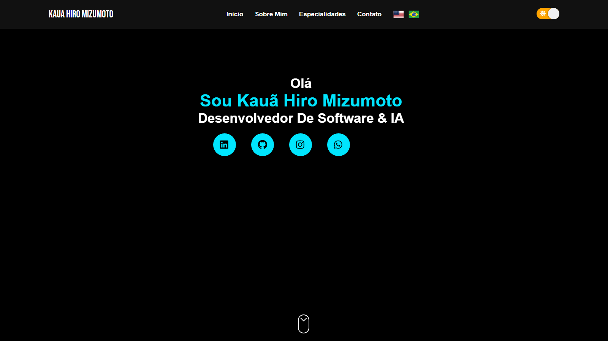

# 🚀 Kauã Hiro Mizumoto — Portfólio Profissional

> Portfólio técnico com foco em Engenharia de Software, Integração de APIs, Automação e Inteligência Artificial Corporativa.

[](https://reactjs.org/)
[](https://create-react-app.dev/)
[](https://swiperjs.com/)
[](https://kaua-hiro.github.io/portifolio-hiro/)

**🔗 Acesse:** https://kaua-hiro.github.io/portifolio-hiro/



---

## 📋 Sumário

- [Sobre o Projeto](#-sobre-o-projeto)
- [Stack Tecnológica](#️-stack-tecnológica)
- [Projetos em Destaque](#-projetos-em-destaque)
- [Funcionalidades](#-funcionalidades)
- [Instalação & Execução](#-instalação--execução)
- [Deploy](#-deploy)
- [Estrutura do Projeto](#-estrutura-do-projeto)
- [Contato](#-contato)

---

## 🎯 Sobre o Projeto

Este portfólio é uma **vitrine técnica** que conecta código a resultado de negócio. O foco está em evidenciar:

✨ **Transformação de Processos** — conversão de fluxos manuais em automações
✨ **Produtização de IA** — IA aplicada a ambientes corporativos
✨ **Engenharia de Integração** — APIs, webhooks e conciliação de dados entre sistemas
✨ **Entrega em Produção** — projetos publicados e acessíveis, não protótipos

### 🏢 Contexto Profissional

Atuo na intersecção entre desenvolvimento e operação, construindo soluções que:

- Eliminam gargalos operacionais
- Automatizam processos críticos (ERP, fiscal, financeiro)
- Integram sistemas legados com tecnologias modernas
- Expõem dados de forma consumível via APIs

---

## 🛠️ Stack Tecnológica

### Este repositório

| Tecnologia | Aplicação |
|-----------|-----------|
| **React 18** | Interface componentizada (JSX) |
| **Create React App** | Build, dev server e code splitting |
| **React Router 6** | Roteamento de páginas |
| **react-intl** | Internacionalização PT-BR / EN-US |
| **Swiper** | Carrossel de projetos responsivo |
| **tsParticles** | Background animado |
| **AOS** | Animações on-scroll |
| **gh-pages** | Publicação automatizada no GitHub Pages |

### Competências demonstradas nos projetos

| Área | Tecnologias |
|------|-------------|
| **Backend & APIs** | Node.js, TypeScript, Python, FastAPI, REST |
| **Dados** | PostgreSQL, SQL Server, Prisma |
| **Full-stack** | Next.js, React, Vite |
| **IA & Automação** | Copilot Studio, RAG, Power Automate, Webhooks |

---

## 💼 Projetos em Destaque

| Projeto | Descrição | Stack | Demo |
|---------|-----------|-------|------|
| **BarberLab** | SaaS de agendamento full-stack | Next.js · Prisma · PostgreSQL | [Ver](https://meu-saas-barbearia-dun.vercel.app/) |
| **TechTeamIA** | Agente de suporte corporativo N1 com RAG | Copilot Studio · IA Generativa · Power Automate | Interno |
| **Ledger** | Gestão financeira profissional | React · Vite · React Router | [Ver](https://finops-ledger-opal.vercel.app/) |
| **Bot Dados Econômicos** | Consumo da API do Banco Central com disparo via webhook | Python · API BCB · Webhook | Interno |
| **Pokedex API** | Consumo de API REST com async/await | JavaScript · REST API | [Ver](https://kaua-hiro.github.io/API_Pokedex/) |
| **Studio Arquitetura** | Landing page de arquitetura e interiores | HTML5 · CSS3 · JavaScript | [Ver](https://hmarquiteturaprojeto.vercel.app/) |
| **Tela de Login** | Interface de autenticação | Next.js · TypeScript · React | [Ver](https://tela-de-login-portfolio.vercel.app/) |
| **Verniz Atelier** | Landing page de salão de beleza | HTML · CSS · JavaScript | [Ver](https://vernizatelier.vercel.app/) |
| **Focinho Feliz** | Landing page de pet shop e day care | HTML · CSS · JavaScript | [Ver](https://petshop-focinho-feliz.vercel.app/) |
| **Aranha-Verso Hub** | Tributo interativo em quadrinhos | HTML5 · CSS3 · JavaScript | [Ver](https://spider-verse-hub.vercel.app/) |

---

## ✨ Funcionalidades

### 🎨 Interface
- Design minimalista com tema dark/light alternável
- Background animado com `tsParticles`
- Animações on-scroll via `AOS`
- Carrossel de projetos com autoplay e navegação por toque
- Responsividade mobile-first (1 / 2 / 3 colunas por breakpoint)

### 🌍 Multi-idioma (i18n)
- Português (PT-BR) e Inglês (EN-US) via `react-intl`
- Troca instantânea sem recarregar a página
- Dicionários em `src/language/`

### 📧 Contato
- Integração direta com Gmail (contorna bloqueio de `mailto:` pelo SO)
- Links diretos para LinkedIn, GitHub, Instagram e WhatsApp
- Currículo em PDF disponível para download

---

## 💻 Instalação & Execução

### Pré-requisitos

- Node.js 18+
- npm ou yarn

### Passos

```bash
# 1. Clone o repositório
git clone https://github.com/kaua-hiro/portifolio-hiro.git
cd portifolio-hiro

# 2. Instale as dependências
npm install

# 3. Execute em modo de desenvolvimento
npm start

# 4. Acesse no navegador
# http://localhost:3000
```

> O `package.json` define `homepage`, então os assets são servidos sob `/portifolio-hiro/` também em desenvolvimento.

### Build de produção

```bash
npm run build

# Sirva o build localmente para teste
npx serve -s build
```

---

## 🚀 Deploy

A publicação é feita no **GitHub Pages** pela branch `gh-pages`, gerada automaticamente pelo pacote `gh-pages`:

```bash
npm run deploy
```

O script `predeploy` executa `npm run build` antes de publicar, então um único comando basta.

---

## 📊 Estrutura do Projeto

```
portifolio-hiro/
├── public/
│   ├── index.html
│   ├── robots.txt
│   └── sitemap.xml
├── src/
│   ├── components/        # Componentes reutilizáveis
│   │   ├── Header/
│   │   ├── Footer/
│   │   ├── Main/          # Seções da home (inclui Project.jsx)
│   │   ├── DarkMode/
│   │   ├── ParticlesBg/
│   │   ├── ScrollToTop/
│   │   ├── ButtomGet/
│   │   └── Content/
│   ├── pages/             # Home, About, Service, Contact, Project
│   ├── context/           # Context API (idioma e tema)
│   ├── language/          # Dicionários i18n
│   │   ├── pt.json
│   │   └── en.json
│   ├── img/               # Imagens e capturas dos projetos
│   ├── cv/cv.pdf
│   ├── App.js
│   └── index.js
├── package.json
└── README.md
```

---

## 🤝 Contribuindo

Este é um projeto pessoal, mas sugestões e feedback são bem-vindos.

1. Faça um fork do projeto
2. Crie uma branch (`git checkout -b feature/SuaSugestao`)
3. Commit suas mudanças (`git commit -m 'Add: sua sugestão'`)
4. Push para a branch (`git push origin feature/SuaSugestao`)
5. Abra um Pull Request

---

## 📄 Licença

Este projeto está sob a licença MIT.

---

## 📞 Contato

**Kauã Hiro Mizumoto**
*Desenvolvedor de Software | Integrações, Automação & IA*

[](https://www.linkedin.com/in/kaua-mizumoto/)
[](https://github.com/kaua-hiro/)
[](https://mail.google.com/mail/?view=cm&fs=1&to=kaua.mizumoto@hotmail.com)

---

<div align="center">

**💼 Disponível para oportunidades em Desenvolvimento, Integração de APIs e IA Corporativa**

[⭐ Deixe uma estrela](https://github.com/kaua-hiro/portifolio-hiro) • [🐛 Reportar Bug](https://github.com/kaua-hiro/portifolio-hiro/issues)

*Desenvolvido com ❤️ e código limpo*

</div>
